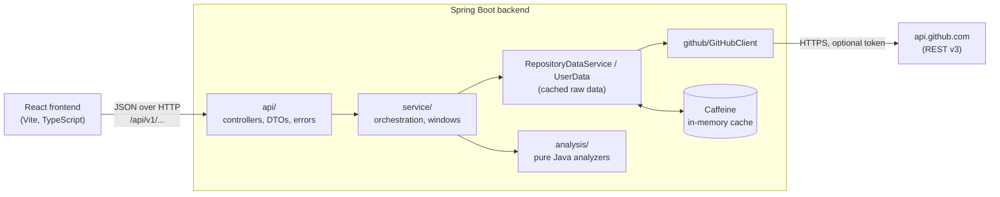
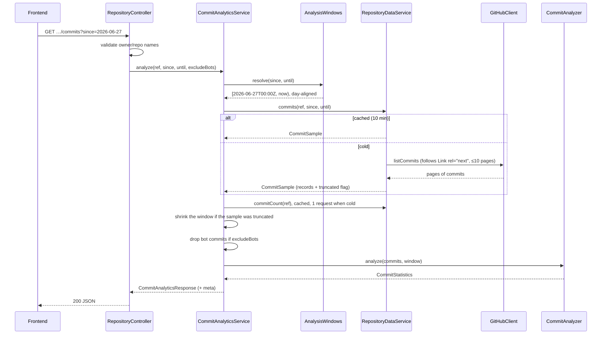

# Architecture

This page explains how GitPulse is built and, more importantly, _why_ it is built that way. For
the API contract see [api.md](api.md); for what each number means see [metrics.md](metrics.md).

## Overview



Two deployable parts:

- **Backend** (`backend/`, Java 21+, Spring Boot 4): the only component that talks to GitHub. It
  owns the token, pagination, rate-limit handling, caching and every calculation.
- **Frontend** (`frontend/`, React 19, TypeScript, Vite, Recharts): renders what the backend
  returns. It never calls GitHub and never sees a token.

There is **no database**. Everything GitPulse shows can be re-derived from GitHub, so the only
state is a short-lived cache. That keeps the project easy to run (`./mvnw spring-boot:run`, no
Docker) and avoids storing data about people.

## Backend layers

Dependencies point one way: `api → service → (analysis, github)`. `analysis` depends on nothing
but the JDK.

| Package    | Responsibility                                                                                                                                                                | Knows about HTTP? | Knows about Spring? |
| ---------- | ----------------------------------------------------------------------------------------------------------------------------------------------------------------------------- | ----------------- | ------------------- |
| `api`      | Controllers, input validation (`GitHubNames`), response DTOs, `GlobalExceptionHandler`                                                                                        | yes               | yes                 |
| `service`  | Resolves analysis windows, fetches data (cached), runs analyzers, assembles responses                                                                                         | no                | yes                 |
| `analysis` | Analyzers: `CommitAnalyzer`, `ContributorAnalyzer`, `PullRequestAnalyzer`, `IssueAnalyzer`, `ActivityAnalyzer`, `FileActivityAnalyzer`, `LanguageAnalyzer`, `ProfileAnalyzer` | no                | no                  |
| `github`   | `GitHubClient`: requests, pagination, counting, error mapping; GitHub JSON models                                                                                             | yes               | minimal             |
| `config`   | Typed configuration (`@ConfigurationProperties`), beans, caches, CORS                                                                                                         | –                 | yes                 |

**Why keep analyzers free of Spring and HTTP?** They hold every formula, so they are where bugs
would do the most damage. As plain functions from records to statistics, they are tested with
dozens of fast unit tests, with no mocks and no network. The service layer is thin glue.

**Normalisation boundary.** GitHub's JSON models (`github/model`) never reach the analyzers. The
data services convert them into small records (`CommitRecord`, `PullRequestRecord`, …) that hold
only the fields a calculation needs. A change in GitHub's API touches one mapping, not every
analyzer.

## A request, end to end

`GET /api/v1/repositories/spring-projects/spring-petclinic/commits?since=2026-06-27`:



Every analysis response carries a `meta` block (`since`, `until`, `sampleSize`, `truncated`,
`botsExcluded`, `timezone`), so a client can always tell exactly what the numbers cover.

## Talking to GitHub

`GitHubClient` wraps Spring's `RestClient` and is the only class that knows GitHub's URLs.

- **Headers:** `Accept: application/vnd.github+json`, a pinned `X-GitHub-Api-Version`
  (`2022-11-28`), and `Authorization: Bearer …` only when a token is configured.
- **Timeouts:** 5 s to connect, 20 s to read. A slow GitHub fails fast instead of holding
  threads.
- **Pagination:** follows the `Link: rel="next"` header, with a page cap per data type. The next
  URL is followed **only if it points at the configured GitHub host** (`isSameOrigin`): a
  manipulated `Link` header cannot make the backend send its token elsewhere.
- **Early stopping:** pull requests and issues are listed newest first, so paging stops as soon
  as a page reaches items older than the window.
- **Counting without downloading:** to count e.g. all commits, request `per_page=1` and read the
  page number of the `rel="last"` link: one request instead of thousands. This does **not** work
  on endpoints with cursor pagination (the issues list has no `last` link), so the client throws
  instead of guessing, and those counts use the Search API.
- **Special statuses:** `202 Accepted` from statistics endpoints means "GitHub is still computing"
  (reported as `PENDING`, and the frontend retries a few times); `409` on commits means an empty
  repository; `404` means "not found **or private**".

### Rate limits

| Limit                    | Anonymous                     | With token   |
| ------------------------ | ----------------------------- | ------------ |
| Core REST API            | 60 / hour                     | 5,000 / hour |
| Search API               | 10 / minute                   | 30 / minute  |
| Secondary (abuse) limits | bursts of concurrent requests | same         |

GitPulse stays within these by design rather than by retrying:

1. **Cache first** (next section). Repeated views cost nothing.
2. **Page caps** on every list (e.g. at most 1,000 commits per window). When a cap cuts a sample
   short, the analysis window is shortened to the period the sample fully covers, and
   `meta.truncated` says so. Reporting unfetched weeks as zero would be wrong.
3. **Expensive work only on demand.** File activity costs one request per commit, so it runs only
   when the user clicks, and the cost is stated first. Without a token, the sample is 20 commits.
4. **Bounded concurrency.** `BoundedParallel` fetches commit details on virtual threads, at most 4
   at a time (a semaphore), to avoid GitHub's secondary limits.
5. **Gating in the UI.** The dashboard requests the overview first and fetches the other sections
   only once the repository is known to exist, so a typo costs one request, not seven.
6. **Degrade, don't fail.** When the small Search quota runs out, counts that depend on it become
   `null` ("Unavailable"), and the rest of the response is unaffected.

When GitHub does refuse (`403`/`429` with `x-ratelimit-remaining: 0` or `Retry-After`), the client
throws `GitHubRateLimitException`. The API returns `429 RATE_LIMITED` with a `Retry-After` header
and a `resetAt` time, and the UI shows when to try again.

## Caching

Caffeine, in memory, configured in `application.yml` and `CacheConfig`.

**What is cached: raw GitHub data, not results.** `RepositoryDataService` and `UserData` cache the
normalised data (commit samples, pull request samples, counts). Analyzers run on every request.
Re-running an analyzer takes microseconds, while a GitHub request is the scarce resource. So
"exclude bots", a different view over the same window, or the activity summary cost **zero**
extra GitHub requests.

| Cache                                                                   | Lifetime | Why                                                                     |
| ----------------------------------------------------------------------- | -------- | ----------------------------------------------------------------------- |
| repositories, languages, commits, pull requests, issues, counts, users… | 10 min   | Activity data changes; 10 min is fresh enough and absorbs repeat visits |
| `commitDetails`                                                         | 24 h     | Keyed by SHA: the content can never change; the limit is only memory    |

Details that matter:

- **Stable keys.** Windows are day-aligned (`AnalysisWindows`), so "the last 90 days" requested at
  10:00 and 10:05 share one cache entry. Names are lowercased (`RepositoryRef`), so
  `Spring-Projects/Spring-Petclinic` and `spring-projects/spring-petclinic` share one too.
- **Don't cache "unknown".** Results meaning "not available yet" (statistics still computing,
  Search quota exhausted) are excluded with `unless = "#result == null"`, so the next request
  asks GitHub again instead of serving a stale gap for 10 minutes.
- **One cache, many methods.** The shared `counts` cache uses `{#root.methodName, #ref}` keys so
  that e.g. open and closed counts for the same repository never collide.
- **Proxy gotcha.** `@Cacheable` works through a Spring proxy, so cached methods are called from
  _other_ beans. A call from inside the same class would silently bypass the cache.

**Trade-off:** an in-memory cache is per instance and lost on restart. For a single-instance tool
that's fine. Running several instances would need a shared cache such as Redis.

## Optional AI explanation

A "Plain-English summary" card, off unless the server has `ANTHROPIC_API_KEY`. Package
`explanation/`:

```
FactSheet ──▶ ExplanationPrompt ──▶ ExplanationModel ──▶ ExplanationVerifier ──▶ response
(numbers only)   (rules + JSON)      (Claude via the       (numbers, fact ids,
                                      Anthropic Java SDK)   wording, length)
```

- **Grounded input.** `FactSheet` turns the dashboard's analyses into id → value facts. Free text
  from GitHub (names, commit messages, descriptions) is never sent. That removes the prompt-injection
  surface and keeps the text about activity, not people.
- **Structured output.** The model must answer in a JSON schema: sentences, each listing the fact
  ids it uses. Effort is `low` (it's rephrasing, not reasoning); thinking stays at the model's
  default (adaptive on Claude Opus 5).
- **Verification.** Every number in a sentence must equal one of its cited facts. Evaluative
  words are rejected. Failing sentences are dropped, and fewer than two survivors means nothing is
  shown. Rules: [metrics.md](metrics.md#ai-explanation-not-a-metric).
- **Cost control.** The request is `POST` (never prefetched) and only sent when the user clicks.
  It's cached for 10 minutes. A sliding-window limiter (`HourlyLimiter`) allows 20 model calls
  per hour per instance by default, counting failed calls too. GitHub data is fetched (and
  GitHub errors raised) before any paid call.
- **Failure handling.** Declined requests are retried server-side on another model
  (`fallbacks: "default"`); refusals, truncated or malformed answers become `AI_UNRELIABLE`;
  network, auth and rate-limit errors from Anthropic become `AI_UNAVAILABLE`. The rest of the
  dashboard never depends on the AI.
- **Testability.** `ExplanationModel` is an interface. Tests use a fake, and the real SDK client
  is tested against a local stand-in HTTP server, so no test calls the paid API.

## Error handling

Every failure becomes an [RFC 9457](https://www.rfc-editor.org/rfc/rfc9457) problem detail with a
stable `code` (`GlobalExceptionHandler`, `ErrorCode`). The frontend branches on `code`, never on
message text.

```
GitHubNotFoundException ─┬─ (repository) → RepositoryNotFoundException → 404 REPOSITORY_NOT_FOUND
                         └─ (user)       → UserNotFoundException       → 404 USER_NOT_FOUND
GitHubRateLimitException                                                → 429 RATE_LIMITED (+ Retry-After, resetAt)
GitHubAuthenticationException (token rejected)                          → 503 GITHUB_AUTH_FAILED
GitHubUnavailableException (timeouts, 5xx)                              → 503 GITHUB_UNAVAILABLE
GitHubApiException (anything else unexpected)                           → 502 GITHUB_ERROR
InvalidRequestException, validation errors                              → 400 INVALID_INPUT
anything else                                                           → 500 INTERNAL_ERROR (logged, no details returned)
```

The GitHub layer throws GitHub-specific exceptions, and the service layer translates them into
domain meaning ("this repository does not exist"). Stack traces and exception messages are never
returned (`server.error.include-stacktrace: never`).

## Frontend

- **URL as state.** Everything needed to reproduce a view lives in the query string (`?repo=`,
  `range`, `bots`, `compare`, `user`), managed by `useUrlState`. Links are shareable, and
  back/forward work.
- **Data fetching.** `useAsync(key, resetKey, fetcher)` cancels superseded requests with an
  `AbortController`, keeps the previous data (dimmed) while a new range loads instead of flashing
  a skeleton, and clears it when the subject changes, so one repository's numbers are never shown
  under another's name.
- **Independent sections.** Each dashboard card has its own request and error state: one
  rate-limited endpoint doesn't blank the page.
- **Code splitting.** The dashboard, compare page and the charting library are lazy-loaded; the
  landing page stays small.
- **Charts** (Recharts) follow the same rules everywhere: every chart has a table view
  (`ChartTable`), values are printed as text rather than encoded only in colour or length, the
  palette works in light and dark mode, and compared charts share one y-axis.
- **Export** is client-side (`utils/export.ts`): the browser already holds every response, so a
  JSON report or CSV file costs no GitHub requests and matches the screen exactly. Formats:
  [api.md](api.md#exported-files).

## Security

- **Token:** read from the environment or a git-ignored `.env`, used only in `GitHubClient`,
  masked in `GitHubProperties.toString()`, never logged or returned. Recommended: a fine-grained
  token, read-only, public repositories only.
- **Outbound requests** go only to the configured GitHub host, including pagination links.
- **Input validation:** owner, repository and user names are checked against GitHub's naming
  rules before any request; path variables are URL-encoded by `RestClient`'s URI templates.
- **Output:** React escapes all GitHub-provided text. Profile "blog" links are rendered only for
  `http(s)` URLs, so a `javascript:` URL can never become clickable. CSV exports prefix
  formula-like text cells with `'` (CSV injection).
- **Privacy:** GitPulse never reads email addresses, shows only public data, and says so in the UI.
- **Surface area:** CORS limited to configured origins; Actuator exposes only `health`; no
  stack traces in errors. Dependabot watches Maven, npm and GitHub Actions.

Reporting vulnerabilities: [SECURITY.md](../SECURITY.md).

## Testing strategy

| Layer         | Tool                            | What is tested                                                             |
| ------------- | ------------------------------- | -------------------------------------------------------------------------- |
| Analyzers     | JUnit 5, AssertJ                | Every formula and edge case (empty, ties, UTC boundaries, truncation)      |
| GitHub client | JUnit + `MockRestServiceServer` | Parsing, pagination, counting, same-origin links, error/rate-limit mapping |
| Services      | JUnit + Mockito                 | Orchestration: windows, gating, degraded (null) counts                     |
| Controllers   | `@WebMvcTest`                   | Validation, status codes, problem-detail bodies                            |
| Frontend      | Vitest + React Testing Library  | Behaviour through the UI with a faked backend; utilities                   |

No test calls the real GitHub API: tests are fast, deterministic, and don't spend quota. CI runs
formatting, all tests and a production build on every push and pull request, with the backend on
JDK 21 and 25.

## Key decisions

| Decision                              | Alternatives                     | Why                                                                                                                                                    |
| ------------------------------------- | -------------------------------- | ------------------------------------------------------------------------------------------------------------------------------------------------------ |
| No database                           | PostgreSQL, H2                   | All data is re-derivable from GitHub; avoids storing data about people; zero setup                                                                     |
| REST API v3                           | GraphQL API v4                   | GraphQL **requires** a token; REST works anonymously, so anyone can try GitPulse. REST counts requests, which is simpler to budget than GraphQL points |
| Cache raw data, not results           | Cache final responses            | Different views over the same data are free; formulas can change without invalidation logic                                                            |
| In-memory Caffeine                    | Redis                            | Single instance; no extra infrastructure. Redis is the upgrade path for scaling out                                                                    |
| Page caps + truncation flag           | Fetch everything                 | Bounded cost per request; honest about coverage instead of silently incomplete                                                                         |
| No conditional requests (ETags) yet   | `If-None-Match` on every request | A `304` only avoids counting against the limit for authenticated requests; most users run without a token. Worth adding when tokens are common         |
| Client-side export                    | `/export` endpoint               | No extra GitHub requests, no duplicate API, exact match with the screen                                                                                |
| Optional AI: summarise, never compute | AI insights, AI chat, no AI      | A model can state wrong numbers fluently. So it only rephrases GitPulse's numbers, every number is checked, and it's off by default                    |
| Descriptive metrics only              | Scores, rankings                 | Activity counts don't measure people; scores invite misuse. Enforced in CONTRIBUTING                                                                   |

## Known limits and next steps

- Default branch only; at most 1,000 commits and 500 pull requests/issues per window.
- A single instance with an in-memory cache. Scaling out needs a shared cache and a per-user
  quota strategy (e.g. each user brings their own GitHub token via OAuth).
- Possible next steps: ETag conditional requests when a token is configured; GraphQL for
  authenticated deployments (fewer round trips); background refresh of popular repositories.
